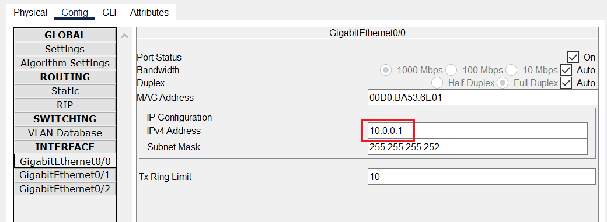
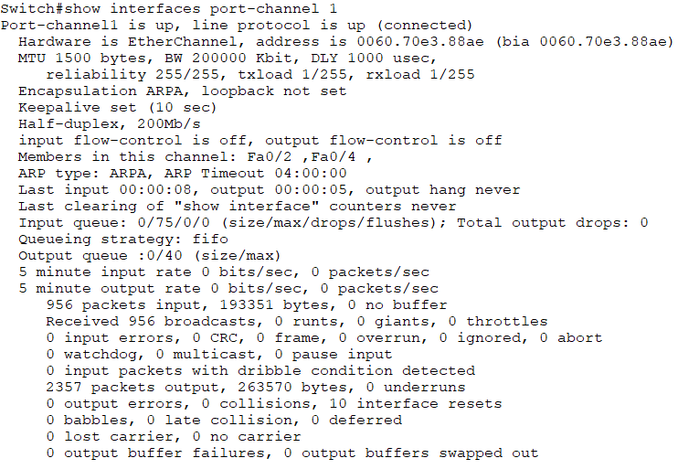

# 🌐 DHCP, VLAN Isolation, Static Routing, and Link Aggregation Lab

## 🧪 Experiment Overview

This laboratory exercise is designed to integrate and demonstrate several core networking concepts within a single topology, including:

* **Dynamic Host Configuration Protocol (DHCP):** Configuring a central DHCP server on the distribution switch.
* **VLAN Isolation:** Segmenting the network into multiple subnets using Virtual Local Area Networks (VLANs).
* **Static Routing:** Implementing static routes to allow communication between the internal network (Switches) and the external network (Router).
* **Link Aggregation (EtherChannel):** Grouping multiple physical links between switches for redundancy and increased bandwidth.

## 🗺️ Network Topology

The overall network structure is detailed in the topology diagram below. The lab consists of three Cisco Switches and one Cisco Router, which serves as the virtual external network gateway.

## 📝 Step-by-Step Configuration Guide

### 1. Initial Router and Distribution Switch Configuration

The first step involves establishing the gateway connection and setting up the distribution layer. We configure the IP address on the Router's external interface (Gig0/0) and the corresponding interface on Switch0.

* **Goal:** Set the initial IP connectivity between the Router and Switch0.
* **Verification:** Ensure Switch0 can successfully ping the Router's IP address.

### 2. Configuring Link Aggregation (EtherChannel)

Link Aggregation (EtherChannel) is implemented between the Distribution Switch (Switch0) and the two Access Switches (Switch1 and Switch2) for redundancy and increased throughput.

* **Configuration:** Group the links connecting Switch0 to Switch1 into **Port-Channel Group 1**. Group the links connecting Switch0 to Switch2 into **Port-Channel Group 2**.

* **Verification:** Confirm that both Port-Channel groups are successfully established and operating.

### 3. DHCP and VLAN Setup on the Distribution Switch

With the aggregated links established, the DHCP services and VLAN configurations are set up on Switch0.

* **DHCP:** Configure multiple DHCP pools, with each pool corresponding to a separate VLAN/subnet, ensuring the correct default gateway is specified.
* **Trunks:** Configure the Port-Channel interfaces as **Trunk** ports to carry all VLAN traffic.

### 4. Access Layer Configuration

The two Access Switches (Switch1 and Switch2) operate purely at Layer 2. Their primary role is to connect end devices and pass VLAN-tagged traffic up to Switch0.

* **Configuration:** Configure the necessary VLANs on these switches, and assign the PC-facing interfaces as **Access Ports** to the correct VLANs.

### 5. Final Connectivity Verification

After all configurations are complete, the final step is to verify end-to-end connectivity across the network.

* **Verification:** Ensure all PCs successfully obtain IP addresses via DHCP and are able to ping the external network's gateway (the Router's IP address).

